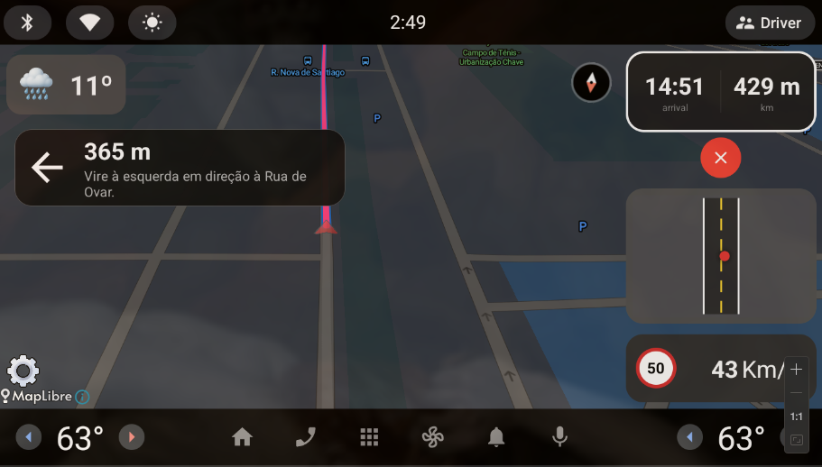

# PEI Automotive Frontend

Frontend system for the [**Automotive App Project**](https://github.com/ATNoG/pei-automotive).

This repo is an Android Automotive app designed for in-vehicle use, who connects to the backend's message broker to receive alerts and updates to then display them accordingly.

## Overview

This Android application is built specifically for automotive environments (**Android Automotive OS**). 

It connects to the **mosquitto MQTT broker** to get the cars positions and display them on the map. It also listens to the `alerts/*` topics to show them to the user in an intuitive way.

We implemented a routing system to optimize the route between two points and allow the user to navigate through the map.

## User Interface



The UI has a full-screen map view optimized for automotive displays.

On the right-side, there is an information panel with essential driving data:
 - It has the current route information (time and distance left). 
 - A top view of nearby cars.
 - The current speed and speed limit.

## Requirements

To build this, we will assume you already followed the build process for the [backend](https://github.com/ATNoG/pei-automotive-backend) and have the cloud2edge system and the Docker services running.

For this app to work, you must:
 - Have **Android Studio** installed.
 - Have an Android Automotive OS compatible device or emulator (we personally use the [Snapp Automotive's build for the Vim3 Pro](https://www.snappautomotive.io/developer-kit)).
 - Make sure that device where the backend is running is in the same network as the device where the frontend will be running.
 - Have a **MapTiler** API Key (get yours at https://cloud.maptiler.com/).
 - Have an **OpenWeatherMap** API Key (get yours at https://openweathermap.org/api).

## Build

### 1. Clone this repo

```bash
git clone https://github.com/ATNoG/pei-automotive-frontend.git
cd pei-automotive-frontend
```

### 2. Create your configuration file:
```bash
vim local.properties
```

Here you must add your API keys and add the private network IP address of the machine where the backend is running:

```properties
# MapTiler API Key
MAPTILER_API_KEY=your_actual_maptiler_api_key_here
# OpenWeatherMap API Key
OPENWEATHER_API_KEY=your_openweathermap_api_key_here
# MQTT Broker Configuration
MQTT_BROKER_ADDRESS=your_private_network_ip_address
MQTT_BROKER_PORT=1884
```

### 3. Open and run the app

Open the app in Android Studio, select your device or emulator and run the app (click the green play button (▶️)).

And that's it! On the Docker logs, you should see a new device connected to the MQTT broker. Now, we can start using the app.

## Usage

Here you just need to refer to the [testing](https://github.com/ATNoG/pei-automotive-backend?tab=readme-ov-file#testing) section of the backend and follow the instructions and the tests simulations should appear in the app.

## License

See [LICENSE](LICENSE) file for details.
