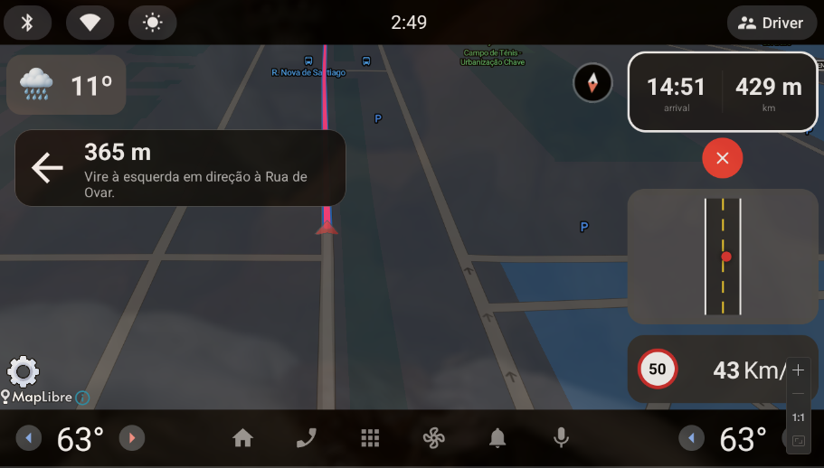

# PEI Automotive Frontend

Frontend system for the [**Automotive App Project**](https://github.com/ATNoG/pei-automotive).

Android Automotive OS app that connects to the backend MQTT broker to receive and display vehicle alerts in real time.

## Overview

Built specifically for **Android Automotive OS**. Connects to the Mosquitto MQTT broker to track car positions on a map and display `alerts/*` events. Includes turn-by-turn routing via OpenRouteService.

## User Interface



Full-screen map view with a right-side panel showing:
- Route info (time and distance remaining)
- Top-down view of nearby vehicles
- Current speed and speed limit

## Pre-built APKs

Each [GitHub Release](https://github.com/ATNoG/pei-automotive-frontend/releases) ships two APKs:

| APK | Connects to |
|-----|-------------|
| `pei-automotive-vX.Y.Z-debug.apk` | `10.0.2.2` — Android emulator host alias. Use with `docker compose up` running locally. |
| `pei-automotive-vX.Y.Z-staging.apk` | `10.255.28.243` — deployed staging VM. |

## Build from source

### Requirements

- Android Studio
- Android Automotive OS device or emulator (we use [Snapp Automotive's build for the Vim3 Pro](https://www.snappautomotive.io/developer-kit))
- [MapTiler](https://cloud.maptiler.com/) API key
- [OpenWeatherMap](https://openweathermap.org/api) API key
- Backend running — see [pei-automotive-backend](https://github.com/ATNoG/pei-automotive-backend)

### 1. Clone

```bash
git clone https://github.com/ATNoG/pei-automotive-frontend.git
cd pei-automotive-frontend
```

### 2. Create `local.properties`

```properties
MAPTILER_API_KEY=your_maptiler_key
OPENWEATHER_API_KEY=your_openweather_key
MQTT_BROKER_PORT=1884
```

Network addresses are baked in per build variant — no need to set them here.

### 3. Select a build variant and run

Open the **Build Variants** panel (**View → Tool Windows → Build Variants**) and pick:

- **`debug`** — connects to `10.0.2.2` (emulator host alias). Start the backend with `docker compose up` and run this variant on the emulator.
- **`staging`** — connects to `10.255.28.243` (staging VM).

Then hit **Shift+F10**.

> **First-time setup:** delete `.idea/` before opening the project if you cloned it fresh or after a package rename — Android Studio caches the old app ID and will fail to launch otherwise.
> ```bash
> rm -rf .idea/
> ```

## Usage

See the [testing section](https://github.com/ATNoG/pei-automotive-backend?tab=readme-ov-file#testing) of the backend repo to simulate vehicles and trigger alerts in the app.

## License

See [LICENSE](LICENSE) for details.
